# What is an SSL Certificate? Why are they important?

SSL stands for Secure Sockets Layer; it is the standard technology for keeping an Internet connection secure and safeguarding any sensitive data sent between two systems. The two systems can be server to client (for example, a shopping website and browser) or server to server (for example, an application with personal identifiable information or payroll information).

# What is a TLS Certificate?

TLS stands for Transport Layer Security, which is just an updated, and more secure, version of SSL. TLS is a cryptographic protocol that establishes an encrypted session between applications over the Internet.

TLS certificates usually contain the following information:

- The subject domain name

- The subject organization

- The name of the issuing CA

- Additional or alternative subject domain names, including subdomains, if any

- Issue date

- Expiry date

- The public key (The private key, however, is kept a secret.)

- The digital signature of the CA

# How does TLS work?
TLS uses a combination of symmetric and asymmetric cryptography, as this provides a good negotiation between performance and security when transmitting data securely.

Lean more about TLS handshake:

[Certificate Management | Usage | Security | Encryption Glossary (encryptionconsulting.com)](https://www.encryptionconsulting.com/education-center/what-is-certificate-management/)

# Standard SSL handshake
The communication over SSL always begins with the SSL handshake. The SSL handshake allows the browser to verify the web server, get the public key, and establish a secure connection before the beginning of the actual data transfer.

The following steps are involved in the standard SSL handshake:

- Client Hello

Server communicates with the client using SSL.

This includes the SSL version number, cipher settings, and session-specific data.

- Server Hello

The server responds with a “server hello” message.

This includes the server’s SSL version number, cipher settings, session-specific data, an SSL certificate with a public key, and other information that the client needs to communicate with the server over SSL.

- Authentication

The client verifies the server’s SSL certificate from the CA (Certificate Authority) and authenticates the server.

If the authentication fails, then the client refuses the SSL connection and throws an exception. If the authentication succeeds, then proceed to the next step.

- Decryption

The client creates a session key, encrypts it with the server’s public key and sends it to the server.

If the server has requested client authentication (mostly in server to server communication), then the client sends their own certificate to the server.

- Encryption with Session Key

The server decrypts the session key with its private key and sends the acknowledgement to the client encrypted with the session key.

Thus, at the end of the SSL handshake, both the client and the server have a valid session key which they will use to encrypt or decrypt the original data.

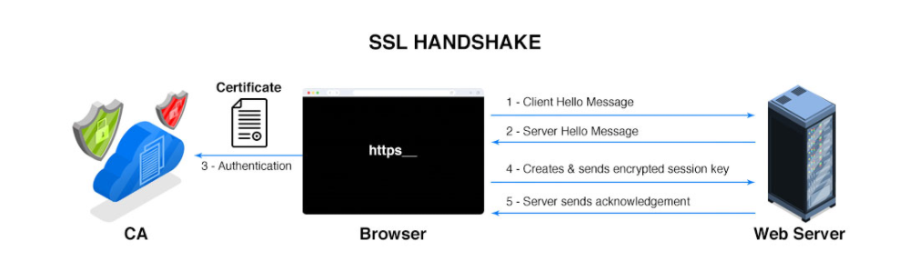

# What are the types of SSL certificates?

There are multiple types of SSL certificates available today based on the validation level and number of domains they secure.

SSL Certificates based on Validation Level:

### Domain Validated certificate

The Domain Validated (DV) certificate requires the lowest level of validation because, the main purpose of DV certificates is to secure communication between the domain’s web server and browser. The CA only verifies that the owner has a control over the domain.

### Organization Validated Certificates

The Organization Validated (OV) certificate requires a medium level validation where the CA checks the rights of an organization to use the domain and the organization’s information. The OV certificate enhances the trust level of the organization and its domain.

### Extended Validated Certificates

The Extended Validated (EV) certificate requires a high-level validation where the CA conducts rigorous background checks on the organization according to guidelines. This includes verification of the legal, physical, and operational existence of the entity.

SSL Certificates based on the Number of Domains:

### Single Domain Certificate

Single Domain Certificates secure one fully qualified domain name or subdomain name.

### Wildcard SSL Certificate

Wildcard certificates cover one domain name and an unlimited number of its subdomains

### Multi-Domain SSL Certificate

The Multi-Domain SSL certificate secures multiple domains using the same certificate with the help of the SAN extension. It is especially designed to secure Microsoft Exchange and Office Communication environments.

# How will visitors know my site has an SSL certificate?

There are a few visual clues mentioned below to indicate a website has an SSL certificate:

- Padlock to the left of a URL

- An https URL prefix instead of http

- A trust seal

- A green address bar (when an EV SSL certificate is issued)

# How does SSL/TLS use both asymmetric and symmetric encryption?

SSL uses symmetric encryption to encrypt data between the browser and web server while asymmetric encryption is used to exchange generated symmetric keys which validate the identity of the client and server.

Difference between SSL and TLS Certificates

# The Difference between SSL and TLS certificates are minor, the notable differences include:

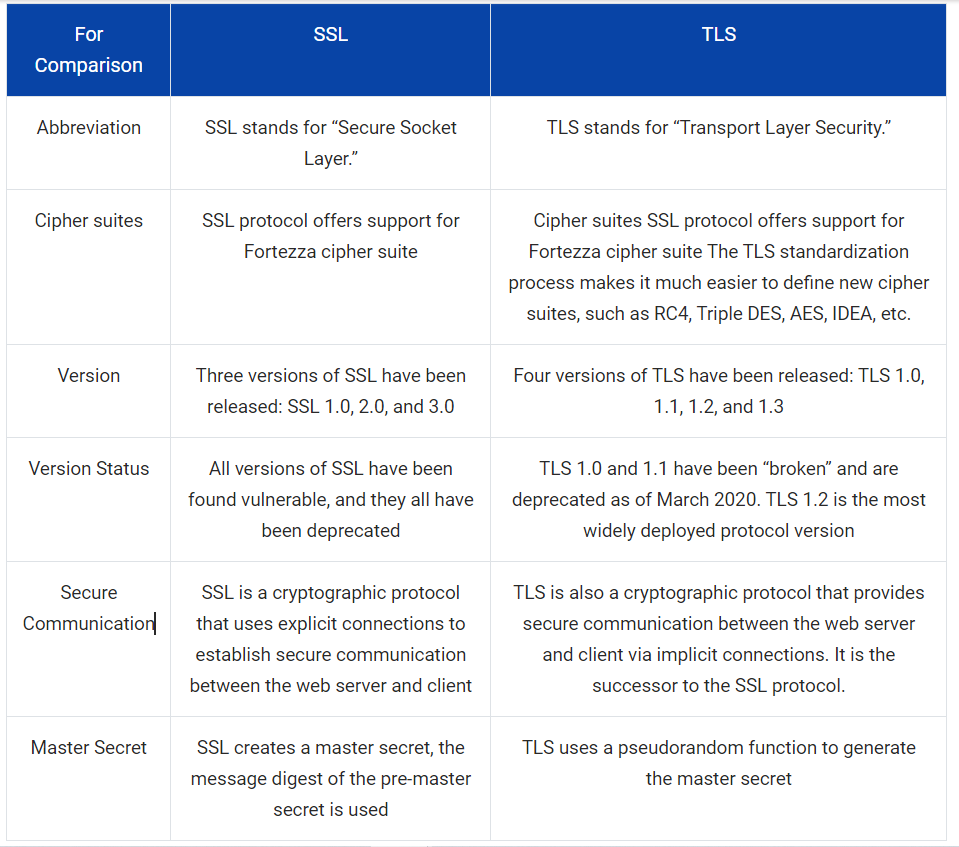

# How to check an SSL certificate in Chrome and Firefox

Any site visitor can follow the below step to get certificate information in Chrome:

- Click the padlock icon in the address bar for the website

- Click on Certificate (Valid) in the pop-up

- Check the Valid from dates to validate the SSL certificate is current

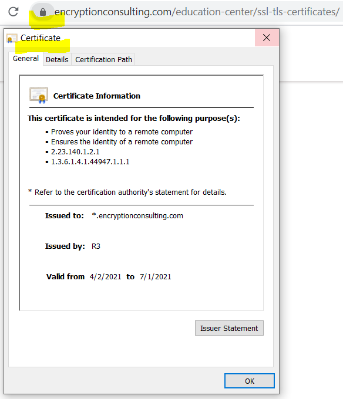

# How to find your SSL certificate

There are two methods to locate the installed SSL certificates on a website you own. In Windows Server environment, the installed certificates are stored in Certificate Stores, there are containers which holds one or more certificates. These containers are
 

- Personal, which holds certificates associated with private keys to which the user has access.

- Trusted Root Certification Authorities, which includes all the certificates in the Third-Party Root Certification Authorities store, plus root certificates from customer organizations and Microsoft

- Intermediate Certification Authorities, which includes certificates issued to subordinate CAs.

You can check the certificate stores manually on your local machine:

Step 1: Open Microsoft Management console (mmc)

Run > type mmc > Enter

Or

Open command prompt > type mmc > Enter

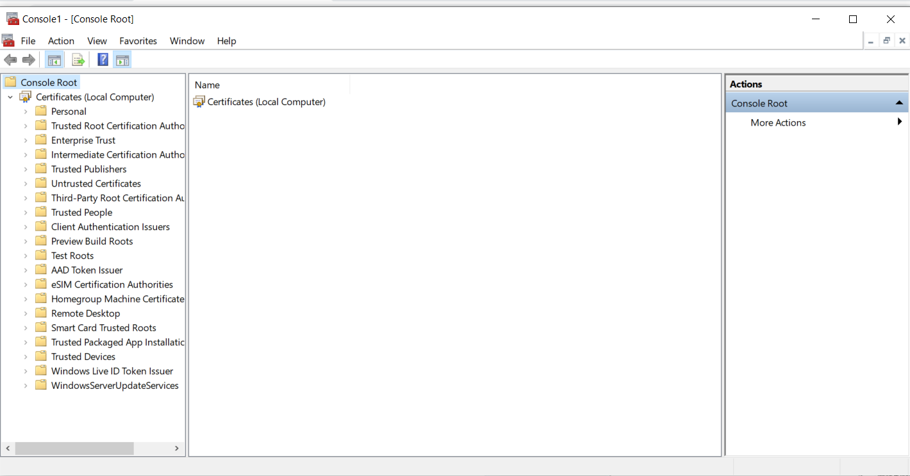

Step 2: Click on File from the menu > select Add/Remove Snap-in

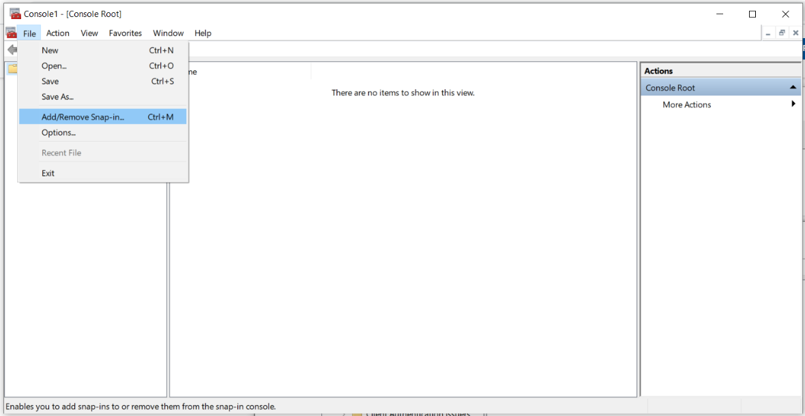

Step 3: From the Available snap-ins list, choose Certificates, then select Add.

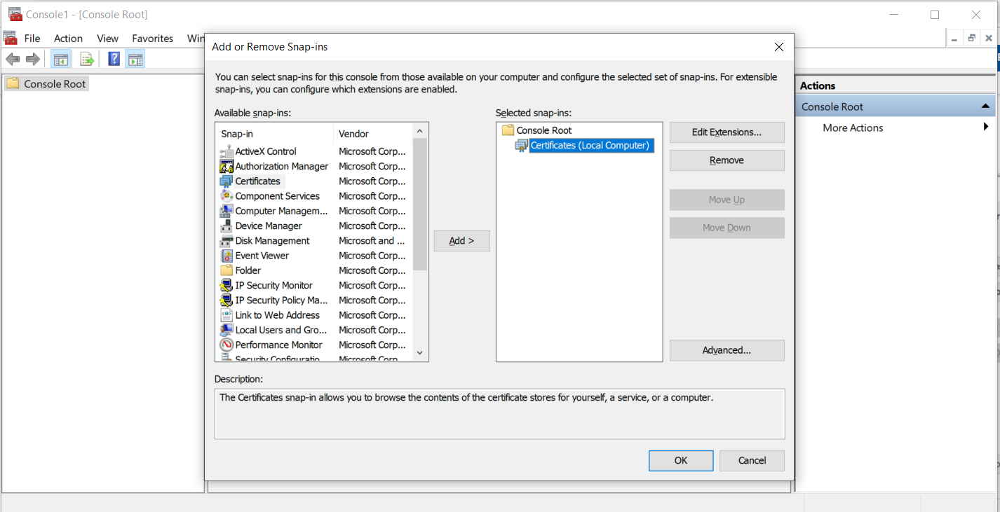

Step 4: Select Computer account > click Next.

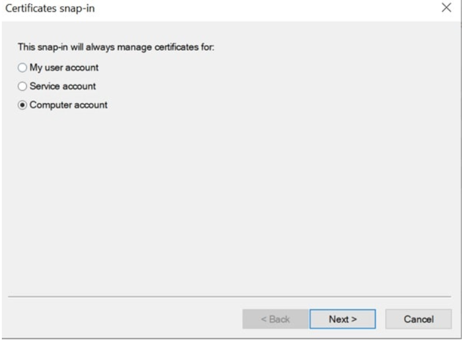

Step 5: Select Local computer > click Finish.

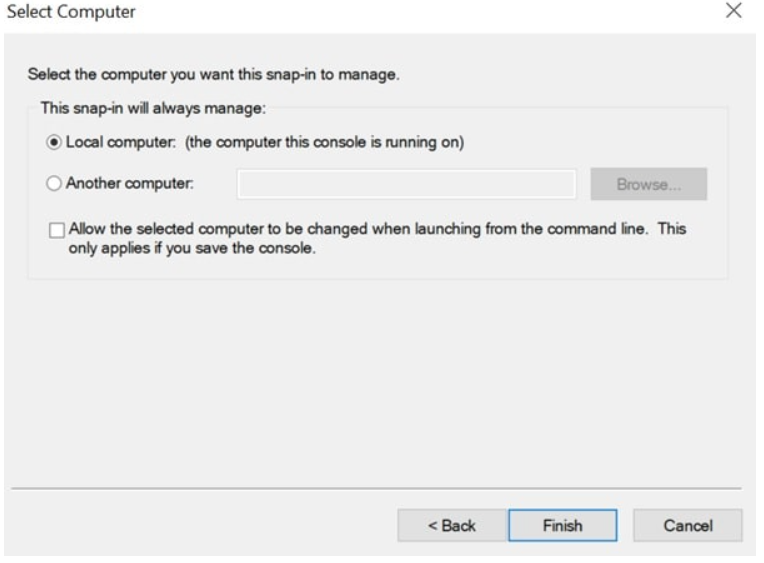

Step 6: At the “Add or Remove Snap-ins” window > click OK.

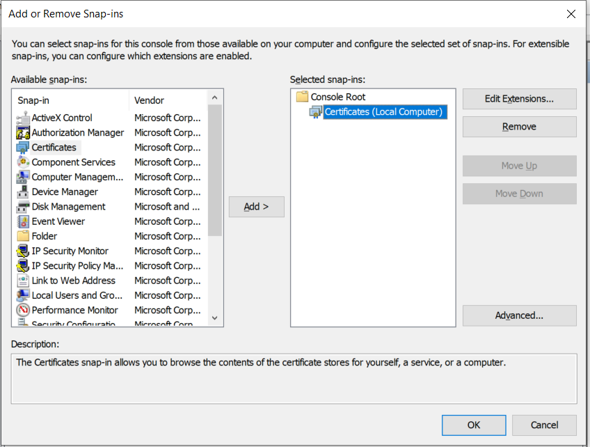

Step 7: To view your certificates in the MMC snap-in > select a certificates store on the left pane. The available certificates are displayed on the middle pane.

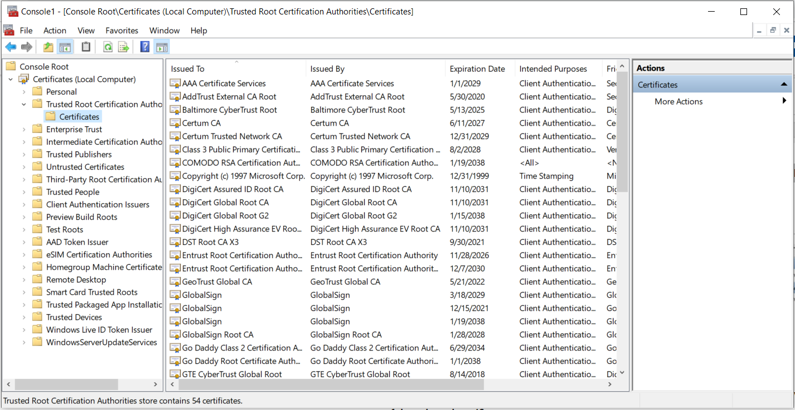

Step 8: Double click on a certificate, the Certificate window appears which displays the various attributes of the selected certificate.

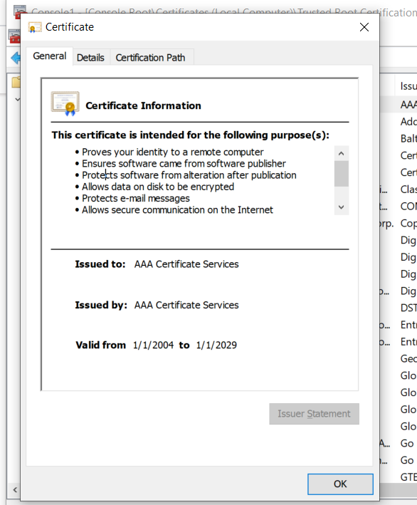

